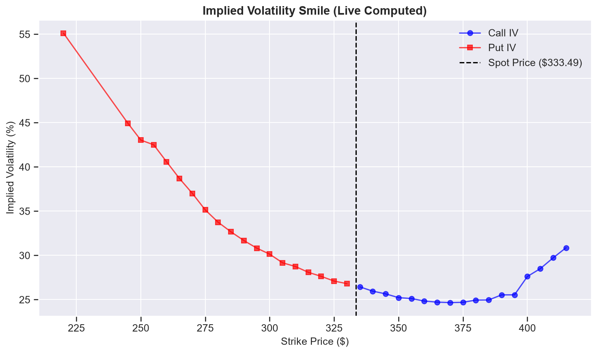

# quant-options-pricer

A Python engine that downloads live option chains from Yahoo Finance and
computes the implied-volatility smile for one expiry, by inverting
Black–Scholes with a Newton–Raphson solver.

The solver checks whether a price actually determines the volatility.
When it does not, it returns `None` instead of a number. On 2,480
synthetic cases it recovers every identifiable volatility and never
returns a wrong one
(see [Solver](#solver-when-implied-volatility-is-not-identifiable)).

<!--  -->

## Quick start

Tested with Python 3.14 on Windows 11.

```bash
git clone https://github.com/fra-steffe/quant-options-pricer.git
cd quant-options-pricer
python -m venv .venv
.venv\Scripts\activate          # Windows
# source .venv/bin/activate     # macOS / Linux
python -m pip install -r requirements-dev.txt
python main.py
```

Run `main.py` during the regular US session (15:30–22:00 Italian time).
Outside it, Yahoo returns zero bid/ask for AAPL options and every
contract is dropped.

`main.py` picks the first AAPL expiry at least 30 days away, prints how
many contracts were dropped at each step, and writes the results
(strike, type, implied vol, mid price, spot) to a CSV in the project
root. The notebook `demo_volatility_smile.ipynb` plots the most recent
CSV.

## Tests

```bash
python -m pytest
```

58 tests, about 1 second, no network access. They cover put–call
parity, reference prices from Hull (8th ed., Example 14.6), prices at
expiry, solver round trips, the cases where the solver must return
`None`, and the cleaning and filtering of option chains.

## How it works

1. **Data** (`scrapers.py`): spot price, expiry dates and option chain
   from Yahoo Finance through `yfinance`, behind an abstract
   `DataProvider` interface.
2. **Cleaning** (`transformers.py`): keeps contracts with a two-sided
   quote (bid > 0 and ask ≥ bid) and uses the mid, (bid + ask) / 2, as
   the market price. The last traded price is not used: it can be hours
   or weeks old.
3. **One option per strike** (`keep_otm`): calls with K ≥ F and puts
   with K < F, where F = S·e^(rT) is the forward. By put–call parity a
   call and a put on the same strike have the same implied vol, and the
   out-of-the-money one has the tighter spread. The boundary is the
   forward, not the spot, because Black–Scholes depends on the spot
   only through F.
4. **Implied vol** (`solvers.py`): Newton–Raphson on the Black–Scholes
   price with analytical vega, starting from the Manaster–Koehler
   guess. That starting point is where vega is at its maximum, and from
   there Newton converges monotonically for any price within the
   no-arbitrage bounds.

## Solver: when implied volatility is not identifiable

The solver stops when the model price is within `tol = 1e-4` of the
market price. A price tolerance becomes a volatility tolerance of about
`tol / vega`: when vega is small (short maturities far from the money,
deep in-the-money options), a whole range of volatilities reproduces
the same price.

At convergence the solver computes vega at the solution. If
`tol / vega` exceeds `vol_tol = 1e-3` (0.1 vol points), it returns
`None`: the price does not determine the volatility to that precision.

`scripts/validity_grid.py` prices options with a known volatility and
runs the solver on those prices. Each case is classified before solving
(identifiable or not, from the vega at the true volatility) and checked
after (correct volatility, `None`, or a wrong volatility).

```bash
python -m scripts.validity_grid
```

Grid: calls and puts, strikes 50–200, maturities from 1 day to 3 years,
volatilities 5%–100%, S = 100, r = 5%.

| Case | correct | None | wrong | Total |
|---|---|---|---|---|
| Identifiable | 1334 | 0 | 0 | 1334 |
| Not identifiable | 4 | 1142 | 0 | 1146 |

The 4 non-identifiable cases solved correctly lie just past the border:
the grid judges with vega at the true volatility, the solver with vega
at the one it found.

Calls with true volatility 20% (`ok`: correct, `-`: `None`). Puts give
the same pattern.

| T \ K | 50 | 70 | 90 | 100 | 110 | 130 | 160 | 200 |
|---|---|---|---|---|---|---|---|---|
| 0.02 | - | - | - | ok | - | - | - | - |
| 0.25 | - | - | ok | ok | ok | ok | - | - |
| 1 | - | ok | ok | ok | ok | ok | ok | ok |
| 3 | ok | ok | ok | ok | ok | ok | ok | ok |

These results hold for S = 100: `tol` is an absolute price tolerance,
so the border moves with the level of the spot.

## Results on AAPL

Run of 2 October 2026, about 18:40 Italian time, expiry 6 November 2026
(35 days), spot 333.29:

```
Contracts in chain:            50
  dropped, no valid quote:      0
  dropped, ITM:                20
  rejected by solver:           0
Implied vols computed:         30
```

The smile has the usual equity skew: put IVs rise steeply as the strike
falls, call IVs are flatter.

**Gap at the money.** Put and call IVs do not join at the forward: the
put just below it has an IV about 2 vol points higher than the call
just above it. The forward implied by put–call parity,
F = K + (C − P)·e^(rT), comes out below S·e^(rT), and by the same
amount on every strike near the money. So the model forward is too
high, which lowers call IVs and raises put IVs at the money (observed on
AAPL runs in October 2026). The parity forward cannot separate the
error in r, the missing dividend yield and the effect of American
exercise.

**Wings.** Far from the money, mid prices are a few cents, close to the
minimum tick, and on longer expiries they are not always monotone in
the strike, which no arbitrage-free set of prices allows. The IVs
computed there are noise. The solver does not reject them: see the
first limitation below.

## Assumptions and limitations

- **Price uncertainty.** The solver treats the market price as exact to
  `tol = 1e-4`. The real uncertainty is half the bid–ask spread, at
  least 0.005 and often much more. The identifiability check above
  therefore works on synthetic prices but rejects nothing on Yahoo
  data, including wing quotes that carry no information on volatility.
- **Forward.** Flat risk-free rate r = 5%, no dividend yield (q = 0).
  This is the cause of the gap at the money.
- **American exercise.** AAPL options are American and are priced here
  as European. Only out-of-the-money options are used, where the
  early-exercise premium is small: calls are almost never exercised
  early on a low-dividend stock, and out-of-the-money puts carry a small
  premium that grows with maturity. The size of this error is not yet
  measured in the repository.
- **Data.** Yahoo Finance only. Option quotes are delayed by about 15
  minutes and are not taken at the same moment as the spot.

## Next steps

- Implied forward from put–call parity for each expiry, and a dividend
  yield in the model (Merton), to remove the gap at the money.
- Half the bid–ask spread as the price uncertainty in the solver, so
  that noisy quotes are rejected.
- Implied-volatility surface over several expiries.

## Project layout

```
Quant_engine/
    instruments.py   European call and put
    scrapers.py      data providers (Yahoo Finance)
    transformers.py  chain cleaning, mid price, out-of-the-money filter
    models.py        Black–Scholes price and vega
    solvers.py       Newton–Raphson implied-volatility solver
scripts/
    validity_grid.py solver validity on a synthetic grid
tests/               pytest suite
main.py              end-to-end run on AAPL
```
